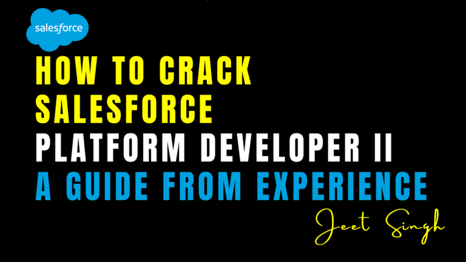

<figure>

<figcaption>

How to Crack Salesforce Platform Developer II: A Guide from Experience

</figcaption>

</figure>

The **Salesforce Platform Developer II** certification is one of the most respected credentials for experienced Salesforce developers. It’s not just about writing Apex or creating Lightning components — it’s about proving your ability to architect, design, and implement complex, scalable solutions using best practices.

In this guide, we’ll walk through how to prepare for Platform Developer II based on real-world experience — covering the exam structure, key topics, preparation strategy, and practical tips that actually work.

## What is Platform Developer II?

Unlike Platform Developer I, which tests fundamental coding knowledge, **Platform Developer II (PDII)** assesses your expertise in advanced Apex programming, performance tuning, asynchronous processing, design patterns, and test automation.

The exam is ideal for developers who have at least 2–3 years of hands-on Salesforce development experience and want to demonstrate their deep technical skills.

## Exam Format

- **Type:** Multiple-choice + Superbadge completion (you must complete 4 specific Superbadges to get the credential)
- **Number of Questions:** 60
- **Time:** 120 minutes
- **Passing Score:** 70%
- **Prerequisite:** Platform Developer I certification

## Topics You Must Master

#### 1\. Advanced Apex

Understand interfaces, virtual/abstract classes, custom exceptions, dynamic Apex, and limits optimization. You should also know how to implement Apex design patterns.

#### 2\. Asynchronous Programming

Be comfortable with `@future`, `Queueable`, `Batch Apex`, and `Scheduled Apex`. Know when to use each and how they behave in terms of limits, order of execution, and testability.

#### 3\. Testing Strategy

You must be proficient in test automation techniques, mocking callouts, setting up test data, and ensuring proper coverage and assertions. You should also understand test execution order and isolation.

#### 4\. Integration and Web Services

Know how to consume and expose REST and SOAP APIs, handle JSON/XML, and use tools like `HttpRequest`, `HttpResponse`, and `Continuation`.

#### 5\. Performance Tuning

Understand how to reduce view state size, avoid common bottlenecks in code, and implement caching strategies where appropriate.

#### 6\. Security and Sharing

Write Apex that respects org-wide defaults, role hierarchy, sharing rules, and FLS/CRUD enforcement.

#### 7\. Design Patterns

Be familiar with patterns like Singleton, Factory, Strategy, and how to apply them in Apex to improve reusability and scalability.

## How I Prepared (From Experience)

#### Step 1: Deep-Dive into Apex

I started with areas I wasn’t confident in — like dynamic Apex and design patterns. Reading the [Apex Developer Guide](https://developer.salesforce.com/docs/atlas.en-us.apexcode.meta/apexcode/) helped me understand inner classes, interfaces, and access modifiers at a deeper level.

#### Step 2: Complete the Superbadges

Salesforce requires the completion of these Superbadges:

- Apex Specialist
- Data Integration Specialist
- Advanced Apex Specialist
- Lightning Web Components Specialist

These Superbadges simulate real-world development challenges and prepare you for the type of logic and thinking required in the PDII exam.

#### Step 3: Hands-On Practice

I used a personal Developer Org to build projects from scratch — queueable chains, external API integrations, and trigger frameworks. Solving actual problems improved my speed and clarity during the exam.

#### Step 4: Mock Exams and Review

Practice tests from trusted platforms helped identify weak areas. I didn’t just memorize — I reviewed each incorrect answer, revisited documentation, and rewrote concepts in my own words.

## Tips to Crack the PDII Exam

- Focus on **why** something is done a certain way, not just how.
- Be comfortable with reading and interpreting complex Apex code snippets.
- Practice building **modular, reusable code** using design patterns.
- Don’t neglect **Lightning Web Components**, even if you’re more backend-focused.
- Always relate what you learn to real-world use cases.

## Final Words

Cracking the Salesforce Platform Developer II exam is a challenge, but it’s also one of the most rewarding milestones in a developer’s career. It not only boosts your resume but also transforms the way you approach building solutions on the platform.

If you’re looking for structured guidance, mentorship, or live project-based learning, check out the Salesforce Developer programs at [jeet-singh.com](http://www.jeet-singh.com/). It’s built to help serious developers go beyond certification and become true Salesforce experts.
