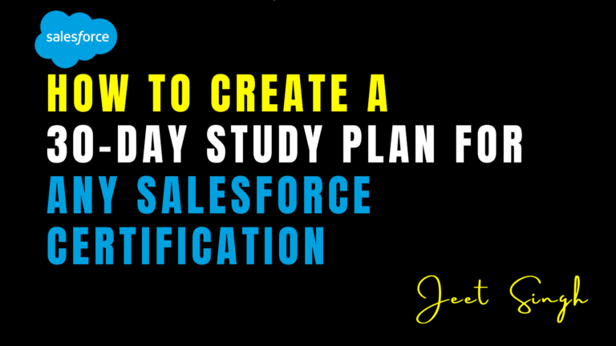

<figure>

<figcaption>

How to Create a 30-Day Study Plan for Any Salesforce Certification

</figcaption>

</figure>

Salesforce certifications are your ticket to high-growth, in-demand careers across industries. But one of the most common challenges beginners face is: _“Where do I start?”_ Without a clear plan, it’s easy to get overwhelmed or waste time on low-impact topics.

In this guide, we’ll show you how to create an effective 30-day study plan for **any Salesforce certification** — whether it’s Admin, Developer, App Builder, or Consultant — using a smart, structured approach proven to work. And if you’re looking for step-by-step training with expert support, **jeet-singh.com** is here to help you every step of the way.

## Why 30 Days?

A 30-day study window strikes the right balance between focus and flexibility. It’s long enough to cover all exam topics without burnout, but short enough to maintain momentum and stay committed. Most successful students who follow a focused plan can get certified in a month — even if they’re working or studying part-time.

## Week 1: Get Oriented with the Exam Blueprint

Start by understanding the structure of the certification exam. Each exam has a published outline that breaks down the topics and their weightage. This should guide how you allocate time across different sections.

**Goals for Week 1:**

- Review the official exam guide
    
- Break down the topics into weekly and daily segments
    
- Familiarize yourself with Salesforce’s user interface (especially for Admin and App Builder tracks)
    
- Join a live orientation session on jeet-singh.com to understand the exam strategy
    

## Week 2: Build a Strong Foundation with Core Concepts

Now it’s time to start learning in depth. Focus on high-weightage areas first and spend time doing practical exercises. Don’t just memorize — make sure you understand how the concepts apply in real business scenarios.

**Goals for Week 2:**

- Learn key concepts (e.g., Objects, Fields, Relationships, User Management)
    
- Practice configuration in a real Salesforce environment
    
- Attend live classes to get real-time guidance and clear doubts
    
- Take short quizzes after each topic to test your understanding
    

## Week 3: Apply What You’ve Learned with Hands-On Practice

This is where things get practical. You should now be comfortable enough to start applying what you’ve learned in mock projects and real-world examples. This is also the best time to reinforce weak areas.

**Goals for Week 3:**

- Work on a mini-project or scenario-based exercise
    
- Participate in live problem-solving sessions at jeet-singh.com
    
- Identify and review weak areas
    
- Take a full-length mock test at the end of the week
    

## Week 4: Review, Revise & Get Exam-Ready

Your final week should be all about polishing your knowledge, fixing gaps, and simulating the real exam environment. This is also the time to focus on exam-taking strategy and managing your time under pressure.

**Goals for Week 4:**

- Revisit important concepts and flashcards
    
- Take 2–3 full mock exams with time limits
    
- Review explanations for every wrong answer
    
- Join a live exam prep session and get final tips from your instructor
    

## Bonus Tips for Staying on Track

- **Set daily goals**: Break big topics into smaller tasks you can complete daily
    
- **Use visual aids**: Charts, mind maps, and diagrams improve retention
    
- **Stay accountable**: Join a live training group at jeet-singh.com for peer support and accountability
    
- **Ask questions early**: Don’t wait until the exam to get help — we offer real-time doubt clearing with every course
    

## Let jeet-singh.com Guide Your 30-Day Certification Journey

While this 30-day plan can be followed independently, the most efficient and reliable way to succeed is through **live, expert-led training**. At **jeet-singh.com**, we don’t just help you pass the exam — we help you **understand Salesforce deeply, apply it confidently, and build a career you’re proud of**.

Our certification courses include:

- Structured lesson plans aligned with the exam
    
- Live sessions with real-time Q&A
    
- Hands-on practice and mock exams
    
- Career guidance and mentorship after certification
    

## Ready to Get Certified in 30 Days?

Start strong, stay consistent, and get expert help every step of the way. Join our next live batch and follow our proven 30-day certification prep strategy — only at **jeet-singh.com**.
