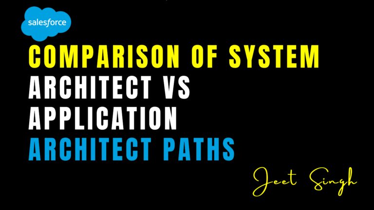

<figure>

<figcaption>

Comparison of System Architect vs Application Architect Paths

</figcaption>

</figure>

For Salesforce professionals pursuing advanced certifications, the **Application Architect** and **System Architect** titles mark two distinct milestones on the path to becoming a **Salesforce Certified Technical Architect (CTA)**. While both credentials are necessary prerequisites for the CTA, they focus on different skill sets and areas of expertise.

Understanding the difference between these two paths will help you plan your certification journey effectively and align your learning with your career goals.

## Overview of the Architect Paths

Salesforce’s Architect pyramid is divided into two major branches:

- **Application Architect** – Focused on designing scalable applications within the Salesforce Platform.
- **System Architect** – Focused on enterprise-level scalability, integrations, deployment, and identity management.

Both roles are essential in delivering robust Salesforce implementations, but they serve **different functions** within a technical solution.

### 1\. Focus Area and Core Skills

**Application Architect**  
This path emphasizes the **internal design of applications** built on Salesforce. It covers topics like data modeling, security, user experience, and application logic.

Core areas include:

- Data modeling and performance
- Record sharing and visibility
- Declarative app building
- Apex development fundamentals

Professionals in this path are often responsible for ensuring that apps are well-structured, secure, and optimized for the Salesforce user experience.

#### System Architect

In contrast, the System Architect path focuses on **system-level concerns** such as integration, user authentication, deployment, and mobile architecture. It addresses the challenges faced by enterprise environments with multiple systems and users.

#### Core areas include:

- System integration patterns
- API design and usage
- Identity and access management
- Change management and CI/CD
- Mobile strategies and architecture

System Architects typically take ownership of how Salesforce connects to the broader IT landscape.

#### 2\. Required Certifications

To earn the **Application Architect** title, you must complete:

- Data Architecture and Management Designer
- Sharing and Visibility Designer
- Platform App
- BuilderPlatform Developer I

To earn the **System Architect** title, you must complete:

- Identity and Access Management Designer
- Integration Architecture Designer
- Development Lifecycle and Deployment Designer
- Mobile Architecture Designer
    

Both titles demonstrate deep technical skills but in distinct areas of expertise.

#### 3\. Target Audience

**Application Architect** certifications are ideal for:

- Salesforce Developers
- Advanced Admins
- Consultants focused on in-org solutions

**System Architect** certifications are suited for:

- Technical Architects
- Integration Specialists
- Release Managers
- Security Experts

Each path serves a different audience depending on the role they play in Salesforce implementations.

#### 4\. Real-World Application

In a real-world project, **Application Architects** ensure that solutions within Salesforce are well-structured and performant. They focus on the user experience, record access, and how business logic is implemented.

**System Architects**, on the other hand, ensure that Salesforce solutions integrate smoothly with other platforms, scale across thousands of users, and follow enterprise-level best practices for security and deployment.

Both roles collaborate frequently and complement each other in full-scale enterprise projects.

#### 5\. Which One Should You Start With?

There’s no strict rule, but many professionals begin with the **Application Architect** path because it’s closer to hands-on development and configuration. If your current role involves more system-level responsibilities, integrations, or DevOps, starting with the **System Architect** path might be more appropriate.

Ultimately, both certifications are required to sit for the **CTA Review Board**, so the order depends on your background and learning style.

## Conclusion

The Application Architect and System Architect paths represent two sides of the same coin. One focuses on how apps are built within Salesforce; the other focuses on how Salesforce fits into the broader enterprise ecosystem. To become a true technical leader in the Salesforce space, mastering both is essential.

Choose your starting point based on your strengths, and gradually build toward the combined goal: becoming a **Salesforce Certified Technical Architect**.
