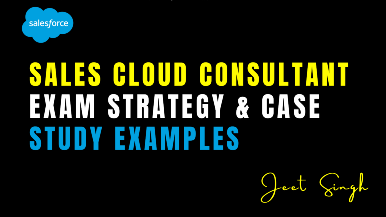

<figure>

<figcaption>

Service Cloud Consultant: Exam Strategy & Case Study Examples

</figcaption>

</figure>

The Salesforce Service Cloud Consultant certification is a key credential for professionals who implement and optimize customer service solutions using Salesforce. It validates your ability to design scalable, high-performance service systems that meet business requirements and improve the customer support experience. This certification goes beyond configuration—it tests how well you understand service operations and how you apply Salesforce features to enhance support workflows.

### What the Exam Really Tests

The exam is designed to assess your ability to apply knowledge in real-world consulting scenarios. It focuses on key areas such as case management, knowledge base implementation, service console configuration, entitlements, omni-channel routing, automation, and integration with other systems. Many questions are framed around customer scenarios, requiring you to evaluate business requirements and recommend the best Salesforce-based solution. To succeed, you’ll need to understand both out-of-the-box functionalities and when to extend them using automation, Apex, or third-party tools.

Understanding the broader business context is equally important. For example, you might be asked how to reduce case resolution time, scale operations during peak seasons, or enable customer self-service options. These aren’t just technical problems—they involve analyzing needs, choosing the right tools, and ensuring long-term scalability and user adoption.

### How to Build an Effective Exam Strategy

Preparation for the Service Cloud Consultant exam begins with a solid understanding of the official exam guide. This outlines the exam objectives and highlights which areas carry the most weight. While Trailhead offers a great starting point, you should also explore mock exams and scenario-based questions to simulate the real test experience. Platforms like Focus on Force provide detailed summaries, case studies, and timed quizzes that are especially useful for identifying weak areas and reinforcing key concepts.

Instead of just reading documentation, try to practice within a sandbox org. Build service flows, set up Omni-Channel routing, configure queues, and test various automation strategies. This hands-on experience will make you more confident when facing complex scenario questions. It also trains your thinking to be solution-oriented, which is essential in a consulting environment where quick and effective decisions are key.

### Real-World Case Study Examples Matter

The ability to interpret and solve case studies is critical for passing the exam. You may encounter a scenario involving a global company that needs to unify its support centers while maintaining region-specific service rules. Another case may describe a business with poor first-contact resolution and ask you how to improve agent efficiency using console features or automation tools.

Reflecting on your own project experience, or exploring publicly shared use cases, will give you insight into how businesses operate and what solutions work best in specific contexts. For example, understanding when to use macros versus quick actions, or how to implement SLAs using milestones and entitlements, can help you quickly eliminate incorrect answer choices during the exam.

### Leveraging the Salesforce Community

Joining active Salesforce communities can significantly enhance your learning. Whether it’s through LinkedIn groups, Trailblazer community forums, or Slack channels, connecting with other consultants will expose you to different problem-solving styles and tips for exam day. Mock interview sessions, peer reviews, and study groups are great ways to improve your confidence and refine your approach to scenario-based challenges.

You can also learn a lot from watching videos or reading blogs of certified professionals who share their own exam journey, mistakes to avoid, and the thought processes they used to choose the right answers. These insights often go beyond what’s available in documentation and provide a more practical lens on how Salesforce tools are used in the field.

### Consultant Mindset Over Configuration Skills

What sets a consultant apart from an admin or developer is the mindset. The Service Cloud Consultant exam expects you to think holistically about customer service. That means considering agent efficiency, customer satisfaction, automation, reporting, and long-term scalability all at once. You’re not just building features—you’re solving business problems.

During the exam, you’ll often face choices that all seem correct. The best way to pick the right one is to think like a consultant: What’s scalable? What’s maintainable? What improves user experience? What aligns best with business KPIs? If you train yourself to think this way during preparation, you’ll be much more equipped to handle complex questions under pressure.

## Conclusion

Becoming a Salesforce Certified Service Cloud Consultant is a powerful step toward advancing your career in the consulting space. The certification proves that you can translate service challenges into Salesforce solutions that scale, automate, and improve customer satisfaction. With the right preparation strategy, practical experience, and scenario-based thinking, you’ll not only pass the exam—you’ll also elevate your value as a trusted advisor in customer service transformation. This credential signals to employers and clients alike that you're ready to lead impactful service projects using the full power of the Salesforce platform.
