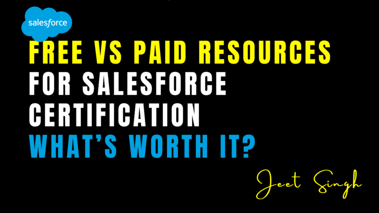

<figure>

<figcaption>

Free vs Paid Resources for Salesforce Certification – What’s Worth It?

</figcaption>

</figure>

When preparing for a Salesforce certification, one of the biggest questions learners face is whether to rely on free resources or invest in paid options. With so many platforms offering tutorials, practice exams, and complete training programs, it can be difficult to decide what’s actually worth your time and money. The truth is, both free and paid resources can be valuable—but understanding how and when to use each can make your preparation journey smoother, more efficient, and more affordable.

## The Power of Free Salesforce Certification Resources

Salesforce has made a strong commitment to open learning through its official free platform, Trailhead. For most beginners, Trailhead is the perfect starting point. It provides interactive modules, hands-on challenges, and guided learning paths for every Salesforce certification, including Admin, Developer, and Consultant tracks. Because it’s created by Salesforce itself, you can trust the accuracy and relevance of the content.

Beyond Trailhead, the Salesforce community is rich with free resources. YouTube channels, blogs, and forums like the Salesforce Developer Community, Reddit, and StackExchange offer real-world insights, troubleshooting help, and community advice. Platforms like Focus on Force even offer free sample questions and blog posts to help learners grasp key topics.

Free content is especially useful when you’re exploring Salesforce for the first time or when you’re trying to identify which certification to pursue. It’s also a smart choice for reinforcing concepts and staying updated with new features after you’ve already covered the basics.

## Where Paid Resources Shine

While free content is extensive, there comes a point in your certification prep when you might need more structure, accountability, and depth. This is where paid resources come in. Websites like Focus on Force, Udemy, and Salesforce Ben offer premium study guides, mock exams, and video courses that are well-organized and aligned directly with certification exam objectives.

Many learners find paid practice exams particularly valuable because they mirror the actual testing environment. This helps reduce exam anxiety and improve time management. Paid resources also tend to offer comprehensive coverage of edge cases and complex scenarios that free content may not fully address.

Additionally, joining live or recorded training sessions from professional instructors can provide clearer explanations, real-time support, and industry context that’s hard to find in self-paced material. These structured courses are often designed with specific career goals in mind and are ideal for professionals who need a fast-track learning path.

## Which One Should You Choose?

The decision between free and paid resources depends on several factors—your budget, learning style, timeline, and prior experience. If you’re new to Salesforce or working with a tight budget, start with Trailhead and supplement it with free YouTube videos and community forums. Once you’ve built a solid foundation, consider investing in paid resources if you feel stuck, want more practice exams, or are aiming for a higher-level certification like Platform Developer II or Application Architect.

In many cases, a hybrid approach works best. Use free content to explore and build core understanding, then switch to paid resources for focused exam preparation and assessment. This way, you get the best of both worlds—depth without overspending.

## Final Thoughts

Free resources are more accessible than ever and can absolutely help you pass most Salesforce certifications. However, paid resources often add the polish and precision needed to truly master the material and approach the exam with confidence. Think of paid tools not as shortcuts, but as accelerators for your learning. By combining both types of content wisely, you can prepare effectively, save time, and succeed in your Salesforce certification journey—without breaking the bank.
