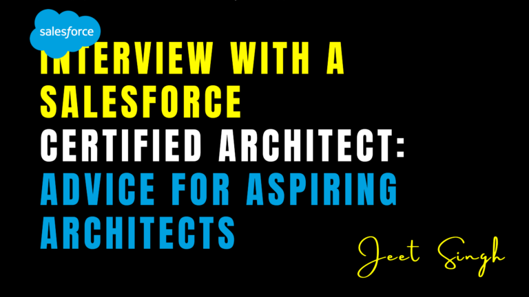

<figure>

<figcaption>

Interview with a Salesforce Certified Architect: Advice for Aspiring Architects

</figcaption>

</figure>

In the ever-evolving world of cloud computing, Salesforce stands tall as a market leader, and within this ecosystem, the role of a Salesforce Certified Architect is both prestigious and in high demand. To shed light on this career path, we sat down with a Salesforce Certified Architect who has spent over a decade designing scalable, secure, and innovative Salesforce solutions across multiple industries. His insights offer valuable guidance for anyone looking to pursue a career as a Salesforce Architect.

## The First Steps: Building a Strong Foundation

The journey to becoming a Salesforce Architect is not a straight line. It often begins with mastering the fundamentals—either as a Salesforce Admin, Developer, or Consultant. Our guest explained that understanding the platform inside-out is crucial before you can design enterprise-level solutions. He emphasized that aspiring architects should start by getting hands-on with the platform, building real-world solutions, and pursuing foundational certifications like Salesforce Administrator and Platform Developer I. These certifications not only validate technical knowledge but also provide a strong base to build upon.

## Thinking Like an Architect: Beyond Coding

As the conversation unfolded, the Architect stressed the importance of thinking beyond code. “A great Salesforce Architect doesn’t just write Apex,” he said. “They understand business requirements, stakeholder goals, and how to align technical solutions with strategic objectives.” He believes that architectural thinking involves a balance of technical expertise, business acumen, and communication skills. This mindset is cultivated over time through experience and exposure to complex Salesforce implementations.

## The Value of Salesforce Certifications

One of the biggest takeaways from the interview was the significance of certifications in advancing your Salesforce career. The Architect highlighted the value of the Salesforce Architect certification path, particularly the Application Architect and System Architect credentials, which serve as stepping stones to the coveted Certified Technical Architect (CTA) title. According to him, preparing for these certifications pushes you to dive deeper into core areas such as data modeling, integration patterns, identity and access management, and governance. They test not only your knowledge but your ability to apply it in high-stakes environments.

## Overcoming Common Challenges

When asked about common challenges on the path to becoming a Salesforce Architect, he pointed to the temptation to rush the process. “A lot of people want to jump straight to the architect title without truly understanding the layers beneath it,” he said. “But to design effectively, you need to understand the limitations, governor limits, and best practices that apply at each level of the stack.” He advised newcomers to remain patient, continuously upskill, and seek mentorship from those already in the role.

## Final Advice: Keep Evolving

Finally, the Architect shared a piece of advice that resonated deeply: “Never stop learning. Salesforce releases new features three times a year, and the ecosystem is always evolving. If you’re serious about becoming a Salesforce Architect, make learning and adaptability your superpowers.”

For anyone aiming to build a career in Salesforce architecture, this interview serves as a reminder that success is a blend of experience, certifications, strategic thinking, and a passion for continuous growth. The road to becoming a Salesforce Certified Architect may be demanding, but for those who commit to the journey, the rewards are well worth the effort.
