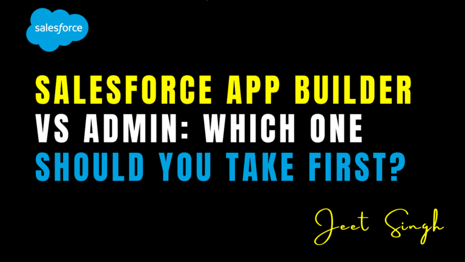

<figure>

<figcaption>

Salesforce App Builder vs Admin: Which One Should You Take First?

</figcaption>

</figure>

If you're starting your journey in the Salesforce ecosystem, you've likely come across two key certifications: **Salesforce Certified Administrator** and **Salesforce Certified Platform App Builder**. Both are valuable, but the common question for beginners is — **which one should you take first?**

In this blog, we’ll break down the roles, responsibilities, and certification scope of both, so you can confidently choose the one that best fits your goals.

## Overview of Both Certifications

#### Salesforce Certified Administrator

This certification focuses on understanding the **core Salesforce platform**, including user management, security, automation, and data access. It’s the foundation for all other Salesforce roles.

Ideal For:

- Beginners
- Support Specialists
- CRM Admins
- Business Analysts

**Key Topics Covered:**

- Org setup and customization
- User and data management
- Reports and dashboards
- Workflow, Process Builder, and Flow
- Security and sharing settings

#### Salesforce Certified Platform App Builder

This certification is more **development-focused**, even though it doesn’t require coding knowledge. It tests your ability to design and build custom apps using the Salesforce Platform's point-and-click tools.

**Ideal For:**

- Admins with some experience
- Junior Developers
- Customization-heavy roles
- Anyone building apps or automation

Key Topics Covered:

- Custom objects and fields
- Lightning App Builder
- Declarative automation (Flows)
- Data modeling
- App deployment and debugging

### Key Differences at a Glance

| Criteria | Admin Certification | App Builder Certification |
| --- | --- | --- |
| Focus | Core CRM functionalities | App design and customization |
| Coding Required | No | No (declarative tools only) |
| Recommended Experience | 0–6 months | 6+ months hands-on practice |
| Role Alignment | Support/Admin roles | Developer/App Builder roles |

## Which One Should You Take First?

If you're **completely new** to Salesforce, the **Admin Certification** is the best place to start. It gives you a solid foundation and prepares you to handle real-world CRM tasks. Once you’re confident with the platform, you can level up with the App Builder certification.

On the other hand, if you’ve already been working with Salesforce for a while — especially if you're building apps, customizing layouts, or creating advanced Flows — then the App Builder path might suit you right away.

## Recommendation Based on Career Goals

- **Want to become a Salesforce Admin?** → Start with **Admin Certification**
- **Want to build apps and automation?** → Begin with **Admin**, then go for **App Builder**
- **Want to become a Salesforce Developer (without coding yet)?** → Start with **App Builder**, only if you have prior platform knowledge
    

## Final Thoughts

Both certifications are valuable, and many professionals eventually earn both. However, for most beginners, **starting with the Salesforce Administrator Certification** provides a clearer understanding of the platform’s fundamentals and opens more entry-level job opportunities.

Once you're confident managing users, objects, reports, and automation, transitioning into the App Builder role becomes much easier.

For structured, live training to help you pass either exam, check out available programs on [jeet-singh.com](http://www.jeet-singh.com/).
