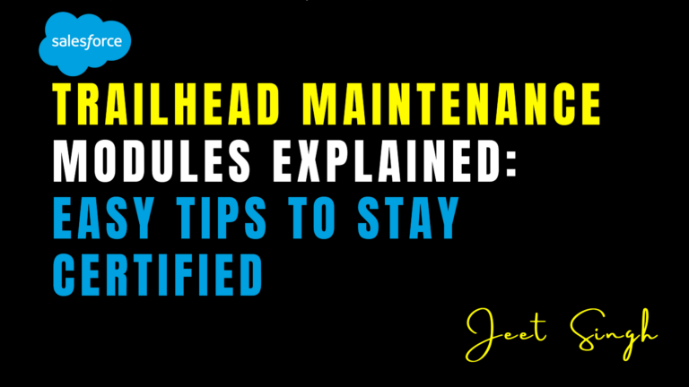

<figure>

<figcaption>

Trailhead Maintenance Modules Explained: Easy Tips to Stay Certified

</figcaption>

</figure>

Salesforce Trailhead is a powerful learning platform that helps professionals gain certifications and sharpen their skills. However, maintaining those certifications requires completing **Trailhead Maintenance Modules**—a process that can be confusing if you're unprepared.

In this guide, we’ll break down:

- What Trailhead Maintenance Modules are
- Why they’re important for keeping your certification active
- Simple strategies to complete them efficiently
- Common mistakes to avoid

By the end, you’ll have a clear action plan to stay certified without stress!

## What Are Trailhead Maintenance Modules?

Maintenance Modules are **mandatory updates** released by Salesforce to ensure certified professionals stay current with the latest platform features. They typically cover:
